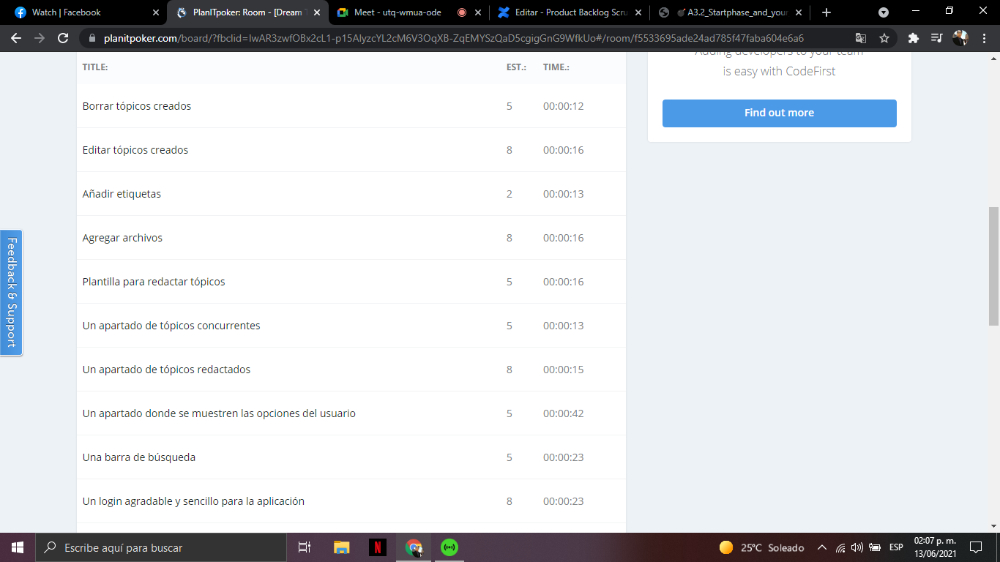

# Meeting evidence

      

      

      

### Conclusions

#### **Cota Villa Edy Jesús Manuel**
In this activity we develop one of the vital tools for the Scrum methodology, which is the backlog, where, based on epics derived from several stories, these stories are derived from the epics and we explain in more detail the functionalities that the product should have, with the acceptance criteria that is used to be mark as completed and together with an assessment that is carried out as a team and that is vital to determine the weights that sprints should have, in general I found this activity very good.

#### **Jaramillo Regino Hector Armando**
In this activity we made a consolidation with respect to the requirements, from which we took the epics and user stories, I found this activity quite interactive since we made use of various tools such as planIt poker with which we made the estimation and we determined the priority of the epics as well as the user stories, having a template with the information that the activity required made it easier to do it.

#### **Dehesa Zazueta Riggel Alioth**
The product backlog is a great tool for work definition, it helps to divide the development process in understandable modules and each one having more defined tasks, making the process a lot simpler than traditional requirement definition, it also helps to make the project more flexible with its requirements and goals.

#### **Morales Arismendi Cristhian Antonio**
The Scrum methodology taught me to break down a project into very small parts, assigning roles and estimated times to the activities to be able to develop it. However, having a motivated team is not the only key to the success of a Scrum project. Without product vision, nothing can be developed. The next chapter will immerse you in the role of the Product Owner and explain how to build and order the Product Backlog.

### :bomb: Rubric

| Criteria     | Description                                                                                  | Score |
| ------------- | -------------------------------------------------------------------------------------------- | ------- |
| Instructions | Each of the points indicated in the section "The company complies with each one of the following points Instructions?            | 10      |  
| Development    | Each of the points requested in the development of the activity was answered?     | 60      |
| Demonstration  | The student introduces himself during the explanation of the functionality of the activity?            | 20      |
| Conclusions  | A personal opinion of the activity is included for each team member? | 10      |

### :bookmark: Links

**Cota Villa Edy Jesús Manuel**

:house: [Repository](https://github.com/CotaVilla/AnalisisAvanzadoDeSoftware_Feb21-Jul21)

**Jaramillo Regino Hector Armando**

:house: [Repository](https://github.com/HectorJaramillo/Analisis-Avanzado-de-Software)

**Dehesa Zazueta Riggel Alioth**

:house: [Repository](https://github.com/RiggelDZ/Analisis-Avanzado-de-Software)

**Morales Arismendi Cristhian Antonio**

:house: [Repository](https://github.com/aris-dev/Analisis-Avanzado-de-Software)
