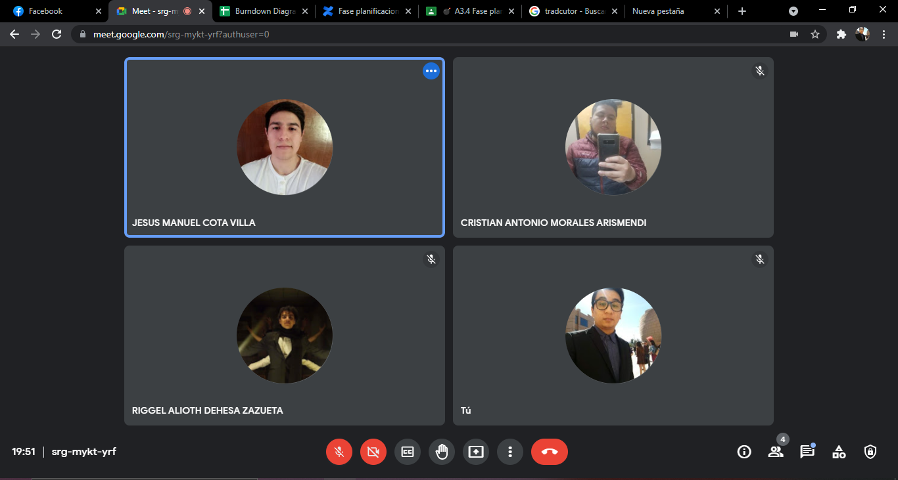
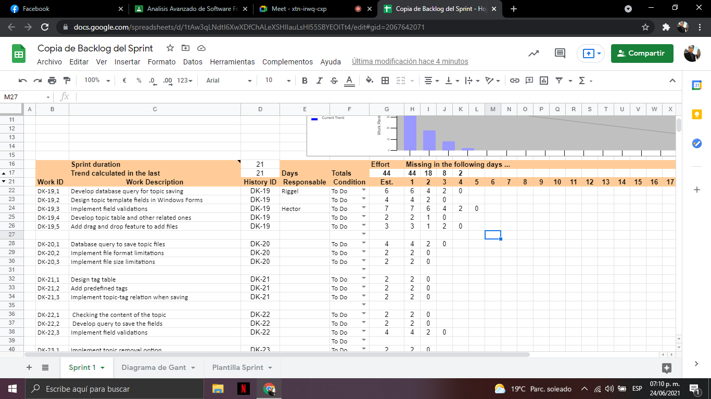
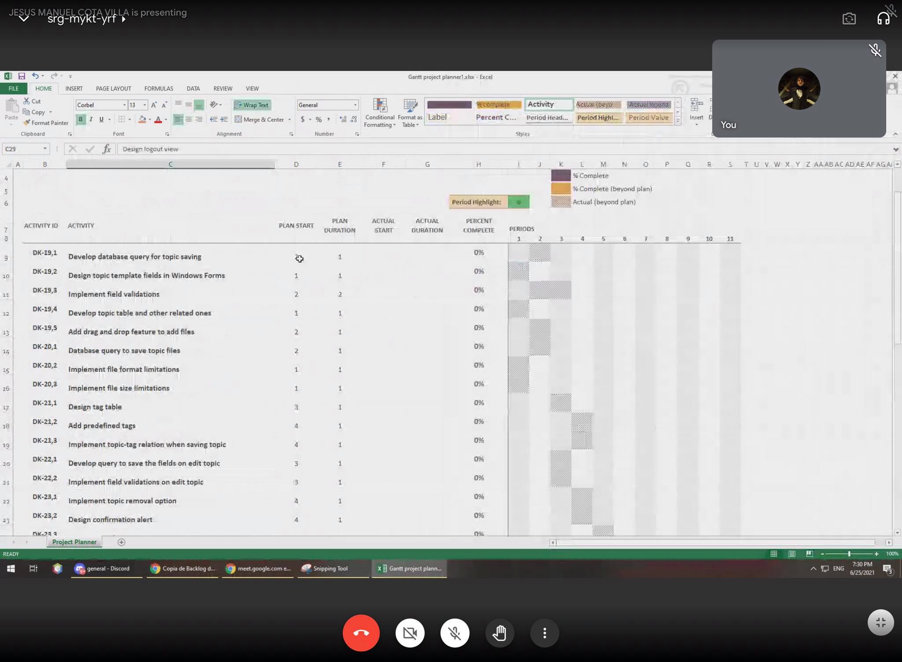

# Introduction

## :trophy: A3.4 Learning activity

Project documentation using the Scrum framework for the planning and estimation phase.

### :blue_book: Instructions

- Based on research and the document provided by the consultant, perform project documentation using the scrum framework for the case study.
- The activity must be carried out using a platform such as **Notion**, or **Confluence**, and must be sent in PDF style, naming it with the nomenclature **A3.4_ActivityName_StudentName.pdf.**.
- Your repository, in addition to having a **readme**.md file in its root directory, with information such as student data, work team, subject, career, advisor data, and even logo or images, must have a contents section or index.
  
## :pencil2: Development

1. Join your team and start preparing what is requested below:
   - [x] 1.1 Identify the tasks for each user story.
   - [x] 1.2 Estimate tasks using a digital tool.
   - [x] 1.3 Create the Sprint backlog with the estimated tasks in hours.
   - [x] 1.4 Develop your gantt chart.
   - [x] 1.5 Identify dependencies of each task and relate it to the activity it depends upon.
   - [x] 1.6 Elaborate Burn down chart the sprint one.

2. Present this information using visual and graphical tools within the sprint planning meeting.
3. Place a section with evidence to show that you came together to develop the activity as a team..
# Meeting evidence

      

      

      

      

      

### Conclusions

#### **Cota Villa Edy Jesús Manuel**
In this activity we carry out the tasks of the user stories that handled 3 epics in order to create a burndown char that allows us to visualize the hours required to complete the sprint, with Excel we calculated a diagram that presented us with two lines the line with the ideal times in the period and how the sprint development process should go and the line that indicates exactly how we are going, where although we would like everything to go according to plan due to the dependencies of the tasks as well as the duration of some it is difficult to follow the ideal line, and as this is reflected in the grant diagram, finally, what was dealt with is that every day they will all carry out some activity that was the most difficult.
#### **Jaramillo Regino Hector Armando**
In this activity we carry out the first sprint backlog creating tasks from the user stories, to later estimate them in hours with the PlanIt Pocker application, we use the excel template that the teacher provided us The activity was not complex as such, just very annoying to do since we took a long time creating the tasks and assigning them to the days to create a balanced workflow in our 2 week sprint, which we determined would last 11 days for 5 weekdays and noon on Saturday.

#### **Dehesa Zazueta Riggel Alioth**
were able to distribute tasks to each one of us, and we were able to estimate them by hours. Scrum by its characteristics is not valid for any project or for any person or team of people. Moreover, Scrum according to many specialists of this methodology, is optimal for work teams of up to 8 people, although there are companies that have used Scrum successfully
#### **Morales Arismendi Cristhian Antonio**
In this activity I learned about how to estimate user stories and decompose each user story into tasks and be able to assign hours to each task through the planning pocket and be able to graph them in a ghant chart, since the planning of our project was to achieve a specific objective through a special series of tasks that do not really cover our entire project as such but part of it, that is why we decided to introduce it in our first sprint.

### :bomb: Rubric

| Criteria      | Description                                                                                  | Score |
| ------------- | -------------------------------------------------------------------------------------------- | ------- |
| Instructions  | Is each of the points indicated in the Instructions section fulfilled?                       | 10      |  | 5 |
| Development   | Was each one of the points requested within the development of the activity answered?        | 60      |
| Demonstration | Does the student introduce himself during the explanation of the functionality of the activity?            | 20      |
| Conclusions   | Is a personal opinion of the activity included by each of the team members?                  | 10      |

### :bookmark: Links

:blue_book:[Concluence](https://itt-isc.atlassian.net/l/c/e1Xg3Nm1)

**Cota Villa Edy Jesús Manuel**

:house: [Repository](https://github.com/CotaVilla/AnalisisAvanzadoDeSoftware_Feb21-Jul21)

**Jaramillo Regino Hector Armando**

:house: [Repository](https://github.com/HectorJaramillo/Analisis-Avanzado-de-Software)

**Dehesa Zazueta Riggel Alioth**

:house: [Repository](https://github.com/RiggelDZ/Analisis-Avanzado-de-Software)

**Morales Arismendi Cristhian Antonio**

:house: [Repository](https://github.com/aris-dev/Analisis-Avanzado-de-Software)

